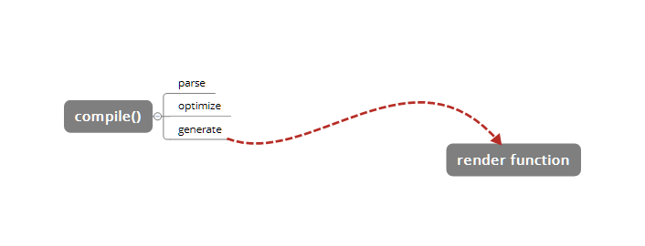
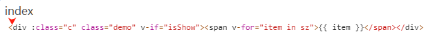
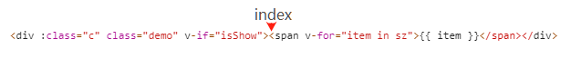

# template 是怎样 compile 编译的

## compile

`compile` 编译可以分成 `parse`、`optimize` 和 `generate` 三个阶段，最终得到 `render function`。这部分不算 Vue.js 响应式核心，只是用来编译的。



这里以一个 template 为例，通过这个示例的变化来看解析的过程。但是解析的过程及结果都是将主要的部分抽离出来了。

```
<div :class="c" class="demo" v-if="isShow">
  <span v-for="item in sz">{{ item }}</span>
</div>

var html = '<div :class="c" class="demo" v-if="isShow"><span v-for="item in sz">{{ item }}</span></div>'
```

## parse

首先是 `parse`，`parse` 会用正则等方式将 template 模板中进行字符串解析，得到指令、class、style等数据，形成 [AST](https://zh.wikipedia.org/wiki/%E6%8A%BD%E8%B1%A1%E8%AA%9E%E6%B3%95%E6%A8%B9)。

> 在计算机科学中，抽象语法树（Abstract Syntax Tree，AST），或简称语法树（Syntax tree），是源代码语法结构的一种抽象表示。它以树状的形式表现编程语言的语法结构，树上的每个节点都表示源代码中的一种结构。之所以说语法是“抽象”的，是因为这里的语法并不会表示出真实语法中出现的每个细节。比如，嵌套括号被隐含在树的结构中，并没有以节点的形式呈现；而类似于 if-condition-then 这样的条件跳转语句，可以使用带有两个分支的节点来表示。
>
> 和抽象语法树相对的是具体语法树（通常称作分析树）。一般的，在源代码的翻译和编译过程中，语法分析器创建出分析树，然后从分析树生成AST。一旦AST被创建出来，在后续的处理过程中，比如语义分析阶段，会添加一些信息。

这个过程比较复杂，会涉及很多的正则进行字符串解析，看一下得到的 AST 的样子。

```
{
  // 标签属性的map，记录了标签上的属性
  'attrsMap': {
    ':class': 'c',
    'class': 'demo',
    'v-if': 'isShow'
  },
  // 解析得到的:class
  'classBinding': 'c',
  // 标签属性v-if
  'if': 'isShow',
  // v-if的条件
  'ifConditions': [
    {
      'exp': 'isShow'
    }
  ]
  // 标签属性class
  'staticClass': 'demo',
  // 标签的tag
  'tag': 'div',
  // 子标签数组
  'children': [
    {
      'attrsMap': {
        'v-for': 'item in sz'
      },
      // for循环的参数
      'alias': 'item',
      // for循环的对象
      'for': 'sz',
      // for循环已经被处理的标记位
      'forProcessed': true,
      // 标签的tag
      'tag': 'span',
      'children': [
        {
          // 表达式，_s是一个转字符串的函数
          'expression': '_s(item)',
          'text': '{{item}}'
        }
      ]
    }
  ]
}
```

最终得到的 AST 通过一些特定的属性，能够比较清晰地描述出标签的属性以及依赖关系。接下来，我们看看怎么使用正则将 template 编译成我们需要的 AST 的。

### 正则

这里首先定义一些我们需要的正则

```
const ncname = '[a-zA-Z_][\\w\\-\\.]*';
const singleAttrIdentifier = /([^\s"'<>/=]+)/;
const singleAttrAssign = /(?:=)/;
const singleAttrValues = [
  /"([^"]*)"+/.source,
  /'([^']*)'+/.source,
  /([^\s"'=<>`]+)/.source
];

// /^\s*([^\s"'<>\/=]+)(?:\s*((?:=))\s*(?:"([^"]*)"+|'([^']*)'+|([^\s"'=<>`]+)))?/
const attribute = new RegExp(
  '^\\s*' + singleAttrIdentifier.source +
  '(?:\\s*(' + singleAttrAssign.source + ')' +
  '\\s*(?:' + singleAttrValues.join('|') + '))?'
); 

const qnameCapture = '((?:' + ncname + '\\:)?' + ncname + ')';

// /^<((?:[a-zA-Z_][\w\-\.]*\:)?[a-zA-Z_][\w\-\.]*)/
const startTagOpen = new RegExp('^<' + qnameCapture); 

// /^\s*(\/?)>/
const startTagClose = /^\s*(\/?)>/;

// /^<\/((?:[a-zA-Z_][\w\-\.]*\:)?[a-zA-Z_][\w\-\.]*)[^>]*
const endTag = new RegExp('^<\\/' + qnameCapture + '[^>]*>'); 

// /\{\{((?:.|\n)+?)\}\}/g
const defaultTagRE = /\{\{((?:.|\n)+?)\}\}/g;

// /(.*?)\s+(?:in|of)\s+(.*)/
const forAliasRE = /(.*?)\s+(?:in|of)\s+(.*)/;
```

### advance

解析 template 采用循环进行字符串匹配的方式，所以没匹配解析完一段，我们需要将已经匹配过的去掉，头部的指针指向接下来需要匹配的部分。

```
function advance(n) {
  index += n;
  html = html.substring(n);
}
```

ex：

当我们把第一个 div 的头标签全部匹配完毕以后，我们需要将这部分除去，也就是向右移动 43 个字符。



调用 `advance` 函数 `advance(43)`，向右移动



### parseHTML

首先定义一个 `parseHTML` 函数，用于循环解析 template 字符串。

```
function parseHTML() {
  while (html) {
    let textEnd = html.indexOf('<');
    if (textEnd === 0) {
      if (html.match(endTag)) {
        // ... process end tag
        continue;
      }
      if (html.match(startTagOpen)) {
        // ... process start tag
        continue;
      }
    } else {
      // ... process text
      continue;
    }
  } 
}
```

`parseHTML` 会用 `while` 来循环解析 template，当匹配到**标签头、标签尾以及文本**的时候进行不同的处理。直到整个 template 被解析完毕。

- [ ] 为了生成 AST，解析的时候需要做哪些处理？
  
### parseStartTag

`parseStartTag` 用来解析起始标签（`"<div :class="c" class="demo" v-if="isShow">"` 部分的内容）。

```
function parseStartTag() {
  const start = html.match(startTagOpen);
  // 匹配到起始标签
  if (start) {
    const match = {
      tagName: start[1], // 标签名称
      attrs: [], // 存放标签内的属性
      start: index
    };
    advance(start[0].length);

    let end, attr;
    // 解析内部所有的属性
    while (!(end = html.match(startTagClose)) && (attr = html.match(attribute))) {
      advance(attr[0].length);
      match.attr.push({
        name: attr[1],
        value: attr[3],
      })
    }
    if (end) {
      match.unarySlash = end[1];
      advance(end[0].length);
      match.end = index;
      return match;
    }
  }
} 
```

### stack

此外，我们需要维护一个 **stack** 栈来保存已经解析好的标签头，这样我们可以在解析尾部标签的时候得到所属的层级关系以及父标签。同时这里定义一个 `currentParent` 变量来存放当前标签的父标签节点的引用，`root` 变量用来指向根标签节点。

```
const stack = [];
let currentParent, root;
```

知道这个以后，这里优化一下 `parseHTML`，在 `startTagOpen` 的 `if` 逻辑中加上新的处理。

```
if (html.match(startTagOpen)) {
  const startTagMatch = parseStartTag();
  // 封装成element，这就是最终形成的AST的节点
  const element = {
    type: 1,
    tag: startTagMatch.tagName,
    lowerCasedTag: startTagMatch.tagName.toLowerCase(),
    attrsList: startTagMatch.attrs,
    attrsMap: makeAttrsMap(startTagMatch.attrs),
    parent: currentParent,
    children: []
  }

  // root指向根节点的引用
  if (!root) {
    root = element;
  }

  // 当前节点放入父节点currentParent的children中
  if (currentParent) {
    currentParent.children.push(element);
  }

  // 将当前节点element压入stack中，并将currentParent指向当前节点
  stack.push(element);
  currentParent = element;
  continue;
}

/**
 * 将attrs转换成map格式
 */
function makeAttrsMap(attrs) {
  const map = {};
  for (let i = 0; i < attrs.length; i++) {
    map[attrs[i].name] = attrs[i].value;
  }
  return map;
}
```

### parseEndTag

同样，在 `parseHTML` 中加入对尾标签的解析函数，为了匹配如 `</div>`

```
const endTagMatch = html.match(endTag);
if (endTagMatch) {
  advance(endTagMatch[0].length);
  parseEndTag(endTagMatch[1]);
  continue;
}
```

用 `parseEndTag` 来解析尾标签，它会从 stack 栈中取出**最近的、跟自己标签名一致的**元素，将 `currentParent` 指向那个元素，并将该元素之前的元素都从 stack 中出栈。

- [X] 解析尾元素的时候，为什么不是取出 stack 栈上的最上面的一个元素才对嘛？
    
  这里面有一些比较特殊的情况，比如可能会存在自闭合的标签，如 `<br/>`，或者写了`<span>` 但是没有加上 `</span>` 的情况，这时候就要找到 stack 中的第二个位置才能找到同名的标签了。

```
function parseEndTag(tagName) {
  let pos;
  for (pos = stack.length - 1; pos >= 0; pos--) {
    if (stack[pos].lowerCaseTag === tagName.toLowerCase()) {
      break;
    }
  }

  if (pos >= 0) {
    stack.length = pos;
    currentParent = stack[pos]; // stack[pos - 1] ?
  }
}
```

### parseText

最后是解析文本，这个比较简单，只需要将文本取出，这时候有两种情况

1. 是普通文本。直接构建一个节点 push 进当前 `currentParent` 的 `children` 中即可。
2. Vue.js 表达式。例如 `{{item}}`，这个时候需要用 `parseText` 来将表达式转化成代码。
   
```
text = html.substring(0, textEnd);
advance(textEnd);

let expression;
if (expression = parseText(text)) {
  currentParent.children.push({
    type: 2,
    text,
    expression
  });
} else {
  currentParent.children.push({
    type: 3,
    text,
  })
}

/**
 * 将表达式转化成代码
 */
function parseText(text) {
  if (!defaultTagRE.test(text)) return;

  const tokens = [];
  let lastIndex = defaultTagRE.lastIndex = 0;
  let match, index;
  while ((match = defaultTagRE.exec(text))) {
    index = match.index;

    // 表达式前面的普通文本直接push到tokens中
    if (index > lastIndex) {
      tokens.push(JSON.stringify(text.slice(lastIndex, index)));
    }

    const exp = match[1].trim();
    tokens.push(`_s(${exp})`);
    lastIndex = index + match[0].length;
  }

  // 表达式后面的普通文本直接push到tokens中
  if (lastIndex < text.length) {
    tokens.push(JSON.stringify(text.slice(lastIndex)));
  }
  return tokens.join('+');
}
```

这里使用一个 `tokens` 数组来存放解析结果，通过 `defaultTagRE` 来循环匹配文本，如果是普通文本则直接 `push` 到 `tokens` 数组中去，如果是表达式（`{{item}}`），则转换成 `_s(${exp})` 的形式。

ex：

```
<div>hello,{{name}}.</div>

/**
 * defaultTagRE.exec('hello,{{name}}.')
 * 0: "{{item}}"
 * 1: "item"
 * groups: undefined
 * index: 6
 * input: "hello,{{item}}."
 */

// 得到的tokens
tokens = ['hello,', _s(name), '.'];

// tokens.join('+')返回的结果
'hello,' + _s(name) + '.';
```

### processIf 和 processFor

最后介绍一下如何处理 `v-if` 以及 `v-for` 这样的 Vue.js 表达式，这里只简单的解析一下两个示例中用到的表达式的解析。

我们只需要在解析头部标签的内容中加入这两个表达式的解析函数即可，在这时 `v-for` 之类指令已经在属性解析时存入了 `attrsMap` 了。

```
if (html.match(startTagOpen)) {
  const startTagMatch = parseStartTag();
  // 封装成element，这就是最终形成的AST的节点
  const element = {
    type: 1,
    tag: startTagMatch.tagName,
    lowerCasedTag: startTagMatch.tagName.toLowerCase(),
    attrsList: startTagMatch.attrs,
    attrsMap: makeAttrsMap(startTagMatch.attrs),
    parent: currentParent,
    children: []
  }

  processIf(element);
  processFor(element);

  // root指向根节点的引用
  if (!root) {
    root = element;
  }

  // 当前节点放入父节点currentParent的children中
  if (currentParent) {
    currentParent.children.push(element);
  }

  // 将当前节点element压入stack中，并将currentParent指向当前节点
  stack.push(element);
  currentParent = element;
  continue;
}
```

首先，这里需要定义一个 `getAndRemoveAttr` 函数，用来从 `el` 的 `attrsMap` 属性或是 `attrsList` 属性中取出 `name` 对应的值。

```
function getAndRemoveAttr(el, name) {
  let val;
  if ((val = el.attrsMap[name]) != null) {
    const list = el.attrsList;
    for (let i = 0, l = list.length; i < l; i++) {
      if (list[i].name === name) {
        // 将它删除
        list.splice(i, 1);
        break;
      }
    }
  }
  return val;
}
```

ex：

```
// 解析实例中的 div 标签属性
getAndRemoveAttr(el, 'v-for');

// 得到的结果
val = "item in sz";
```

有了 `getAndRemoveAttr` 这个函数之后，我们就可以开始进行 `processIf` 和 `processFor` 了。

```
function processIf(el) {
  const exp = getAndRemoveAttr(el, 'v-if');
  if (exp) {
    el.if = exp;
    if (!el.ifConditions) {
      el.ifConditions = [];
    }
    el.ifConditions.push({
      exp: exp,
      block: el
    });
  }
}

function processFor(el) {
  const exp = getAndRemove(el, 'v-for');
  if (exp) {
    const inMatch = exp.match(forAliasRE);
    el.for = inMatch[2].trim();
    el.alias = inMatch[1].trim();
  }
}

/**
 * 'item in sz'.match(forAliasRE)
 * 0: "item in sz"
 * 1: "item"
 * 2: "sz"
 * groups: undefined
 * index: 0
 * input: "item in sz
 */
```

到这里，已经把 `parse` 的过程介绍完了。

## optimize

`optimize` 主要作用跟它名字一样，用作**优化**。

这个涉及到后面要讲 `patch` 的过程，因为 `patch` 的过程实际上是将 VNode 节点进行一层一层的比对，然后将**差异**更新到视图上。那么一些静态节点是不会根据数据变化而产生变化的，这些节点我们没有比对的需求，是不是可以跳过这些静态节点的比对，节省一些性能呢？

那么我们就需要在静态节点上做一些**标记**，在 `patch` 的时候我们就可以直接跳过这些被标记的节点的比对，从而达到**优化**的目的。

经过 `optimize` 这层的处理，每个节点会加上 `static` 属性，用来标记是否是静态的。

```
{
  'attrsMap': {
    ':class': 'c',
    'class': 'demo',
    'v-if': 'isShow'
  },
  'classBinding': 'c',
  'if': 'isShow',
  'ifConditions': [
    'exp': 'isShow'
  ],
  'staticClass': 'demo',
  'tag': 'div',
  // 静态标记
  'static': false,
  'children': [
    {
      'attrsMap': {
        'v-for': 'item in sz'
      },
      'static': false,
      'alias': 'item',
      'for': 'sz',
      'forProcessed': true,
      'tag': 'span',
      'children': [
        {
          'expression': '_s(item)',
          'text': '{{item}}',
          'static': false
        }
      ]
    }
  ]
}
```

接下来用代码实现以下 `optimize` 函数。

### isStatic

首先实现一个 `isStatic` 函数，传入一个 node，判断该 node 是否是静态节点。判断的标准是当 `type` 为 2 （表达式节点）则是非静态节点，当 `type` 为 3 （文本节点）的时候则是静态节点，当然，如果存在 `if` 或者 `for` 这样的条件的时候（表达式节点），也是非静态节点。

```
function isStatic(node) {
  if (node.type === 2) {
    return false;
  }
  if (node.type === 3) {
    return true;
  }
  return (!node.if && !node.for);
}
```

### markStatic

`markStatic` 为所有的节点标记上 `static`，遍历所有节点通过 `isStatic` 函数来判断当前节点是否是静态节点。此外，会遍历当前节点的所有子节点，如果子节点是非静态节点，那么当前节点也是非静态节点。

```
function markStatic(node) {
  node.static = isStatic(node);
  if (node.type === 1) {
    for (let i = 0, l = node.children.length; i < l; i++) {
      const child = node.children[i];
      markStatic(child);
      if (!child.static) {
        node.static = false;
      }
    }
  }
}
```

### markStaticRoots

