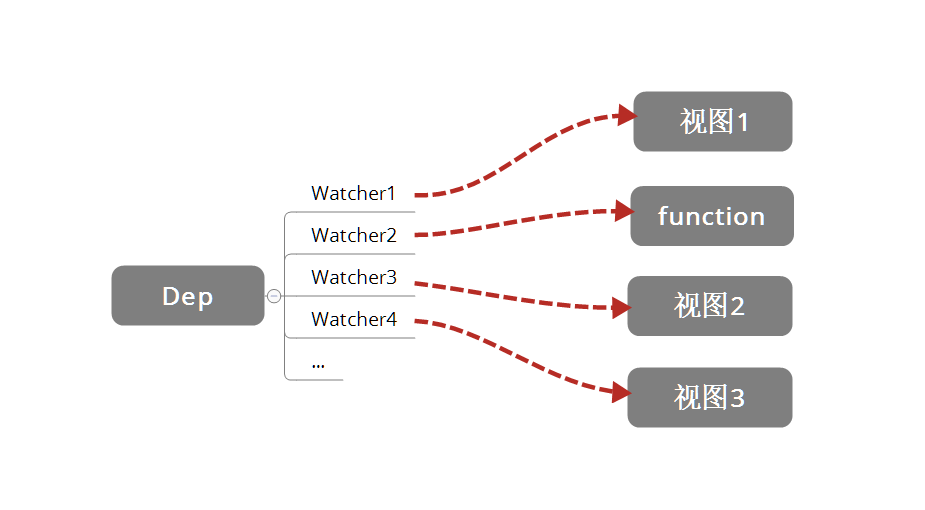

# 响应式的依赖收集

## 为什么要依赖收集

ex1:

我们现在有这么一个 Vue 对象。

```
new Vue({
  template:
    `<div>
      <span>{{ text1 }}</span>
      <span>{{ text2 }}</span>
    </div>`,
  data: {
    text1: 'text1',
    text2: 'text2',
    text3: 'text3'
  }
});
```

然后我们做了这么一个操作

```
this.text3 = 'text3 is changed';
```

我们修改了 `data` 中的 `text3` 的数据，但是因为视图并不需要用到 `text3`，所以我们并不需要触发之前那个例子中的 `cb` 函数来更新视图，调用 `cb` 显然是不正确的。

ex2：

假设我们现在有一个全局对象，我们可以在多个 Vue 对象中用到它进行展示。

```
let globalObj = {
  text1: 'text1'
};

let instance1 = new Vue({
  template:
    `<div>
      <span>{{ text1 }}</span>
    </div>`,
  data: globalObj
});

let instance2 = new Vue({
  template:
    `<div>
      <span>{{ text1 }}</span>
    </div>`,
  data: globalObj
});
```

这个时候，我们执行如下操所

```
globalObj.text1 = 'text1 is changed';
```

我们应该需要通知 `instance1` 以及 `instance2` 两个 vm 实例进行视图的更新，**依赖收集**会让 `text1` 这个数据知道“对了，有两个地方依赖我的数据，我变化的时候需要通知它们~”。

最终形成数据与视图的一种对应关系，如下图



接下来看一下**依赖收集**是如何实现的

## 订阅者 Dep

首先我们实现一个订阅者 Dep，它的主要作用是用来存放 Watcher 观察者对象。

```
class Dep {
  constructor() {
    // 用来存放 Watcher 对象的数组
    this.subs = [];
  }

  // 在 subs 中添加一个 Watcher 对象
  addSub(sub) {
    this.subs.push(sub);
  }

  // 通知所有 Watcher 对象更新视图
  notify() {
    this.subs.forEach((sub) => {
      sub.update();
    })
  }
}
```

为了便于理解，这里着实现了部分方法，主要是两件事：

1. 用 `addSub` 方法可以在目前的 `Dep` 对象中增加一个 `Watcher` 的订阅操作；
2. 用 `notify` 方法通知目前 `Dep` 对象的 `subs` 中的所有 `Watcher` 对象触发更新操作。

## 观察者 Watcher

```
class Watcher {
  constructor() {
    // 在 new 一个 Watcher 对象时将该对象赋值给 Dep.target，在 get 中会用到
    Dep.target = this;
  }

  // 更新视图的方法
  update() {
    console.log('视图更新啦...');
  }
}

Dep.target = null;
```

## 依赖收集

接下来我们修改一下 `defineReactive` 以及 Vue 的构造函数，来完成依赖收集。

我们在闭包中增加一个 Dep 类的对象，用来收集 `Watcher` 对象。在对象被**读**的时候，会触发 `reactiveGetter` 函数把当前的 `Watcher` 对象（存放在 Dep.target 中）收集到 `Dep` 类中去。如果当前对象被**写**的时候，则会触发 `reactiveSetter` 方法，通知 `Dep` 类调用 `notify` 来触发所有 `Watcher` 对象的 `update` 方法更新对应的视图。

```
function defineReactive(obj, key, val) {
  const dep = new Dep();

  Object.defineProperty(obj, key, {
    enumerable: true,
    configurable: true,
    get: function reactiveGetter() {
      // 将 Dep.target（即当前的 Watcher 对象）存放到 Dep 的 subs 中
      dep.addSub(Dep.target);
      return val;
    },
    set: function reactiveSetter(newVal) {
      if (newVal === val) return;
      // 在 set 的时候触发 dep 的 notify 来通知所有的 Watcher 对象更新视图
      dep.notify();
    }
  })
}
```

## 小结

首先在 `observer` 的过程中会注册 `get` 方法，该方法用来进行**依赖收集**。在它的闭包中会有一个 `Dep` 对象，这个对象用来存放 Watcher 对象的实例。

其实**依赖收集**的过程就是把 `Watcher` 实例存放到对应的 `Dep` 对象中去。`get` 会调用 `Dep` 对象的 `addSub` 方法将当前的 `Watcher` 对象（Dep.target）存放到它的 subs 中，在数据变化的时候，`set` 会调用 `Dep` 对象的 `notify` 方法通知它内部所有的 `Watcher` 对象进行视图更新。

这是 `Object.defineProperty` 的 `set/get` 方法处理的事情，那么**依赖收集**的前提条件还有两个：

1. 触发 `get` 方法；
2. 新建一个 Watcher 对象。
   
这个是在 Vue 的构造类中处理的，新建一个 `Watcher` 对象只需要 new 出来，这时候 `Dep.target` 已经指向这个 new 出来的 `Watcher` 对象来。而触发 `get` 方法也很简单，实际上只要把 `render function` 进行渲染，那么其中依赖的对象都会被**读取**。

这里介绍了依赖收集的过程，加上之前的响应式基本原理，这就是 Vue 的整个**响应式系统**。其主要是 `get` 进行依赖收集，`set` 通过观察者来更新视图。

## TODO

- [ ] Watcher 里面有什么？
- [ ] 什么时候创建 Watcher 对象？
- [ ] Watcher 怎么和一个 data 的属性对应上的？
  
